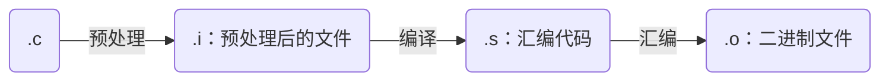
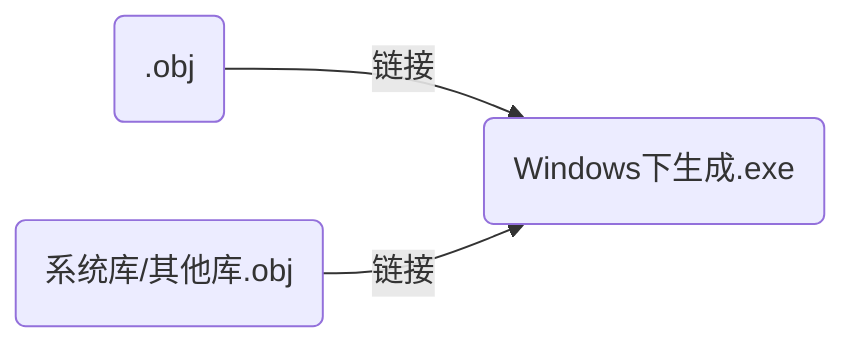

### 1. C 简介 

C语言是`编译型`语言，源码都是`文本文件`，本身无法执行。通过编译器生成二进制可执行文件，才能执行。

> GCC是一个跨平台的编译器集合。可以用于多种操作系统和处理器架构，MinGW是gcc在Windows上的移植版本

#### 1.1. c程序运行机制

**1.编辑**

编写c语言程序源代码`.c文件`。

**2.编译**


- 预处理：包含头文件、取消注释、宏替换等
- 编译：语法分析、词法分析、语义分析、符号汇总（将全局使用的符号`.o`文件中形成符号表），将`C`语言转换为汇编
- 汇编：将C语言程序转换为`目标程序（或目标文件）`，生成`.obj`的二进制文件

**3.链接/连接**


- 不同`.c`隔离编译，一起链接
将编译形成的`.obj`和库函数以及其他目录文件链接，形成`可执行的`二进制文件`.exe`

**4. example**

```shell
# e.g.
gcc hello.c
gcc -o outputname.exe hello.c
gcc -std=c99 hello.c
```

### 2. C语言的预处理

#### 2.1. 声明和定义

1. **声明（Declaration）**
告诉编译器某个变量、函数或类型的名称和类型，但不为它分配内存或提供具体实现。声明的作用是告诉编译器某个符号的存在，以便在代码的其他部分使用它
   - 变量声明：声明变量时，只告诉编译器该变量的名称和类型，但不分配内存或给出值。通常在头文件中进行声明。
    ```c
    // 声明：告诉编译器有一个整数类型的变量 x
    extern int x; 
    ```
   - 函数声明：声明函数时，告诉编译器该函数的名称、返回类型和参数类型，但不提供函数的具体实现。通常在头文件中声明函数。
    ```c
    // 声明：告诉编译器有一个函数 add，返回一个整数，并接受两个整数参数
    int add(int a, int b);
    ```
2. **定义（Definition）**
定义是声明的进一步扩展，除了告诉编译器名称和类型，还为变量分配内存空间，或者为函数提供实际的实现。定义不仅是声明，还包括实际的创建过程。
   - 变量定义：在定义变量时，会为该变量分配内存，并且可以为它赋初值。
    ```c
    // 定义：为变量 x 分配内存
    int x;
    ```
   - 函数定义：在定义函数时，会提供函数的具体实现代码。
    ```c
    int add(int a, int b) {
        return a + b; // 函数的实现
    }
    ```

#### 2.2. 变量初始化

- 如果变量没有显式初始化，那么它的默认值将取决于该变量的类型和其所在的作用域
   - 全局变量和静态变量（在函数内部定义的静态变量和在函数外部定义的全局变量），它们的默认初始值为零
   - 局部变量（在函数内部定义的非静态变量）不会自动初始化为默认值，它们的初始值是未定义的（包含垃圾值）

    | 数据类型 | 初始化默认值 |
    | :------- | :----------- |
    | int      | 0            |
    | char     | '\0'         |
    | float    | 0.0          |
    | double   | 0            |
    | pointer  | NULL         |

#### 2.3. 内存结构

1. 栈
   - 函数运行区域
   - 局部变量
   - 数组
   - 等等
2. 堆
   - malloc
   - calloc
   - realloc
   - free
3. 数据段（静态区）
   - 存放全局变量/静态变量
4. 常量区
   - const修饰
   - 常量字符串
   - 等等
5. 代码段
   - 存放函数体的二进制代码


|  地址  |                   内存区域                   | 说明                                                                          |
| :----: | :------------------------------------------: | :---------------------------------------------------------------------------- |
| 高地址 |                   内核空间                   | 用户代码不能读写                                                              |
|   ↓    |               栈区<br>向下生长               | 函数运行区域、局部变量、形参、返回值等                                        |
|        | 内存映射段<br>（文件映射、动态库、匿名映射） | 共享区                                                                        |
|        |               堆区<br>向上增长               | malloc()、free()等                                                            |
|        |                    静态区                    | .bss：未初始化或初始化为0的全局/静态变量<br>.data：初始化不为0的全局/静态变量 |
|   ↑    |                    常量区                    | .rodata:字符串“ABCD”等                                                        |
| 低地址 |                    代码区                    | .text：存放代码                                                               |

> maybe：‘text’ is your code, and constants (and also the vector table).

#### 2.4. 宏

> `#define`机制包括了一个规定，允许把参数替换到文本中，这种实现称之为宏（macro）

```c
#define name(parament-lsit) stuff
// 其中parament-lsit是一个由逗号隔开的符号表，它有可能出现在stuff中
```
- 参数列表的左括号必须与name紧密相连
- 如果两者之间有任何空白，参数列表就会被解释为stuff的一部分

```c
// e.g.
#define SQUARE(x) x * x
// 预处理会将square(5)替换为5*5
SQUARE(5);
5 * 5;
SQUARE(a + 1);
a + 1 * a + 1;
#define SQUARE(x)  (x) * (x)
```

#### 2.5. 编译器定义的宏

```c
// 该宏包含当前源代码文件的文件名（以字符串形式表示）。
printf("Error in file: %s\n", __FILE__);
// 该宏包含当前行号（以数字形式表示）。
printf("Error at line: %d\n", __LINE__);
// 该宏包含编译时的日期，格式为 Mmm dd yyyy（如 Aug 17 2025）。
// 可以用于记录文件的编译日期，常见于程序版本控制和日志记录。
// 该宏包含编译时的时间，格式为 hh:mm:ss（如 14:35:52）。
printf("Compiled on: %s\n", __DATE__);
printf("Compiled at: %s\n", __TIME__);
// 该宏表示是否遵循 ANSI C 标准。它通常会被定义为 1，表示编译器遵循标准 C。
#ifdef __STDC__
    printf("This is a standard C compiler.\n");
#else
    printf("This is not a standard C compiler.\n");
#endif
// 当使用 C++ 编译器时，编译器会自动定义该宏。它通常为一个整数，表示 C++ 标准的版本号。
#ifdef __cplusplus
    printf("This is a C++ compiler.\n");
#else
    printf("This is a C compiler.\n");
#endif
// 用于版本检测，判断特定版本的 GCC 编译器是否支持某些功能。
// __GNUC__：GCC 主版本号 __GNUC_MINOR__：GCC 次版本号 __GNUC_PATCHLEVEL__：GCC 补丁级别
printf("GCC version: %d.%d.%d\n", __GNUC__, __GNUC_MINOR__, __GNUC_PATCHLEVEL__);
// 该宏表示 GCC 的版本号，类似于 __GNUC__、__GNUC_MINOR__ 和 __GNUC_PATCHLEVEL__，但是以单一整数形式给出。
#if __GNUC_VERS__ >= 40800
    printf("GCC version is 4.8 or higher\n");
#endif
// __APPLE__, __MACH__, __unix__ 等
#ifdef __APPLE__
    printf("This is macOS.\n");
#endif
```

#### 2.6. 头文件

```c
// <>在系统头文件所在目录搜索
#include <stdio.h>
// ""在当前源文件目录搜索，找不到则系统头文件所在目录
#include "stdio.h"
```

#### 2.7. 预处理指令

| 指令     | 描述                                             |
| :------- | :----------------------------------------------- |
| #define  | 定义宏                                           |
| #include | 包含头文件                                       |
| #undef   | 取消已定义的宏                                   |
| #ifdef   |
| #if      |
| #else    |
| #elif    |
| #endif   |
| #error   | 当遇到标准错误时。输出错误消息                   |
| #program | 使用标准化方法，向编译器发布特殊的命令到编译器中 |


### 3. 可能会忘记

1. `perror`
```c
// 把一个描述性错误消息输出到标准错误 stderr。首先输出字符串 str，后跟一个冒号，然后是一个空格。
void perror(const char *str)

#include <stdio.h>
int main ()
{
   FILE *fp;
   /* 首先重命名文件 */
   rename("file.txt", "newfile.txt");
   /* 现在让我们尝试打开相同的文件 */
   fp = fopen("file.txt", "r");
   if( fp == NULL ) {
      perror("Error: ");
      return(-1);
   }
   fclose(fp);  
   return(0);
}
// output
Error: : No such file or directory
```

2. `assert`


### 4. 内存管理函数

`<stdlib.h>`

1. `malloc`
```C
void* malloc(size_t size);
// On success, malloc returns a pointer to the first byte of the allocated memory block.
// On failure, it returns NULL.
// e.g.
int *arr;
size_t n = 5;
arr = (int*)malloc(n * sizeof(int));
```

2. `calloc`
```C
// Unlike malloc(), calloc() initializes all the allocated memory to zero.
void* calloc(size_t num, size_t size);
```

3. `free()`
```C
void free(void *ptr);
free(arr);
```

4. `realloc()`
```C
// 该函数重新分配内存，把内存扩展到 newsize
void* realloc(void* ptr, size_t new_size);
// e.g.
size_t n = 5;
int *arr;
// Initially allocate memory for 5 integers
arr = (int*)malloc(n * sizeof(int));
// Resize the array to hold 10 integers
n = 10;
// Free the allocated memory
free(arr);
```

### 5. printf的使用细节

```c
// %m.nf,m is the minimum width and n is the number of decimal places
float b = 3.14159;
printf("b = %f,\n", b);         // default width and precision
printf("b = %+f,\n", b);        // default width and precision
printf("b = %5.2f,\n", b);      // minimum width 5 and 2 decimal places
printf("b = %5.2f,\n", -b);     // minimum width 5 and 2 decimal places
printf("b = %10.4f,\n", b);     // minimum width 10 and 4 decimal places
printf("b = %010.2f,\n", b);    // minimum width 10 and 2 decimal places 右对齐
printf("b = %-10.2f,\n", b);    // minimum width 10 and 2 decimal places 左对齐
// b = 3.141590,
// b = +3.141590,
// b =  3.14,
// b = -3.14,
// b =     3.1416,
// b = 0000003.14,
// b = 3.14      ,
// ------------------------------------------------
// 常见占位符
// %c
// %d   十进制整数（或%i）
// %ld  十进制整数long
// %u   十进制无符号
// %lu
// %x   十六进制
// %f   浮点数（float）
// %lf  浮点数（double）
// %s   字符串
// %p   指针
// %e   使用科学计数法的浮点数，指数部分的e为小写
// %E   使用科学计数法的浮点数，指数部分的E为大写
// %g   6个有效数字的浮点数，整数部分一旦超过6位自动转换为科学计数法，指数部分e为小写
// %G   等同于%g，E为大写
```

### 6. 关键字

| 类型           | 具体关键字                                                              |
| -------------- | ----------------------------------------------------------------------- |
| 控制语句（12） | break,case,continue,default,do,else,for,goto,if,return,switch,while     |
| 数据类型（12） | char,enum,double,long,float,int,short,signed,struct,unsigned,union,void |
| 存储类型（4）  | auto,extern,register,static                                             |
| 其他（4）      | const,sizeof,typedef,volatile                                           |

**c99:**`inline`,`restrict`,`_Bool`,`_Complex`,`_Imaginary`
**c11:**`_Alignas`,`_Alignof`,`_Atomic`,`_Static_assert`,`_Noreturn`,`_Thread_local`,`_Generic`

1. **`register`存储类**
   - 用于定义存储在寄存器中而不是`RAM`中的局部变量。变量的最大尺寸等于寄存器的大小（通常是一个字），不能直接`&`取地址（因为没有内存位置，不是存储在`RAM`中）。在需要频繁访问的变量上使用`register`存储类可以提高程序的运行速度
   - 定义`register`并不意味着变量将被存储在寄存器中，它意味着变量可能存储在寄存器中，这取决于硬件和编译器等。
2. **`static`存储类**
   - 在程序的生命周期内保持局部变量的存在，不在每次进入和离开作用域时进行创建和销毁。使用`static`修饰局部变量可以在函数调用之间保持局部变量的值
   - static 修饰全局变量时，会使变量的作用域限制在声明它的文件内。
   - 静态变量在程序中只被初始化一次，即使函数被调用多次，该变量的值也不会重置
3. **`extern`存储类**
   - 用于定义在其他文件中声明的全局变量或函数。当使用 extern 关键字时，不会为变量分配任何存储空间，而只是指示编译器该变量在其他文件中定义。
### 7. 标识符

- 不可以数字开头
- 不可以有空格
- 区分大小写
- a-z,A-Z,0-9,_

### 8. 基本数据类型

#### 8.1. 整型

```c
// 1. signed/unsigned char = 1 byte
// 2. signed/unsigned short = 2 byte
// 3. signed/unsigned int = 4 byte
// 4. signed/unsigned long = 4/8 byte 32/64
// 5. signed/unsigned long long = 8 byte
// 编译器通常会将一个整数字面量指定为int型
long x = 123l;          // x = 123L
long long y = 123ll;    // y = 123LL
unsigned int z = 123u;  // z = 123U
```

#### 8.2. 跨平台精确指定宽度

```c 
#include <stdint.h>
```
- `int8_t`
- `uint8_t`
- `int16_t`
- `uint16_t`
- `int32_t`
- `uint32_t`
- `int64_t`
- `uint64_t`

#### 8.3. 浮点类型
- `float 4 byte`
- `double 8 byte`
- `long double 12 byte`

```c
float pi = 3.14;    // 3.14为double类型，隐式转换为float赋值给float pi，某些情况下精度丢失
float a = 3.14f
double b = 3.14;
long double c = 3.14l;
```

##### 8.3.1. 浮点存储规则

```
S：符号位，E：指数，M：有效数字
float: 32 bit = 1 + 8 + 23 [S (1bit) + E (8bit) + M (23bit)]
double: 1 + 11 + 52
(-1)^s,2^e,M
------------------------------------------------
e.g.
类比十进制，1234 = 1.234*10^3，十进制往左移动3位，指数为3
十进制9.5，写成二进制是1001.1，即1.0011*2^3. S = 0, M = 1.0011, E = 3.
1≤M<2 M = 1.xxxxxxxx 因此M默认总是第一位为1，可以舍去不写，节省1bit，如1.01只保存01
float中M:23bit，实际可以得到24bit的有效数字
------------------------------------------------
E占8bit，0-255，0.5 二进制0.1，1.0*2^(-1)，E = -1，加中间数127（double 1023）
则E = 126，0111 1110b .
------------------------------------------------
e.g. 5.5 = 101.1b 1.011*2^2 s = 0, e = 2, m = 1.011
2 + 127 = 129 1000 0001b
0 1000 0001 011 0000 0000 0000 0000 0000 （小数0.5）
```

#### 8.4. 字符类型

- `char a = 'c'`

```c
char A = 'A';   // 65 0x41 0100 0001b
char a = 'a';   // 97 0x61 0110 0001b
char O = 'O';   // 79 0x4F 0100 1111b
char o = 'o';   // 111 0x6F 0110 1111b
// 大小写区别在于位5，大写为0，小写为1
// 利用这点快速全部更改为大写或小写
```

#### 8.5. 转义字符

| 字符形式 | 含义                         |
| :------- | :--------------------------- |
| `\n`     | 换行                         |
| `\t`     | 制表符                       |
| `\'`     | `'`                          |
| `\"`     | `"`                          |
| `\\`     | `\ `                         |
| `\r`     | 回车                         |
| `\0`     | `null`字符 `0x00`            |
| `\b`     | 退格，光标回退，但不删除字符 |

#### 8.6. bool类型（C99以上）

```c
#include <stdbool.h>
```

### 9. 变量variable 常量

1. 变量

- 声明变量：`数据类型 变量名 = 变量值`，`int a = 0, b=1;`
- 作用域：`文件作用域 file scope`，`{}块作用域 block scope`

2. 常量
- 字面常量
- `#define`定义的标识符常量
- `const`修饰的常变量
- 枚举常量

### 10. 输入输出函数

#### 10.1. 输入函数

- `scanf()`，格式输入函数，接收`任意类型`
- `getchar()`，接收`单个字符`
- `gets()`，接收`字符串`

```c
scanf("%d%d%d",&a,&b,&c);   // 2 3 4 用空格回车tab隔开三个数字
scanf("%d,%d,%d",&a,&b,&c); // 只能用,隔开
```

#### 10.2. 输出函数

- `print()`，格式输出函数，输出`任意类型`
- `putchar()`，输出`单个字符`
- `puts()`，输出`字符串`

### 11. 流程控制结构

#### 11.1. if-else

```c
if (condition){
    printf("condition is true.\n");
}
else {
    printf("condition is false.\n");
}
```

#### 11.2. switch-case

```c
// Basic Template for switch-case
// value 整型（含char字符型），不可以是浮点型
switch(value)
{
    case 1 :    // case 紧跟常量值固定值，不可以3<N<5，也可使const修饰的变量
        printf("Value is 1.\n");
        break;
    case 2 :
        printf("Value is 2.\n");
        break;
    case 3 :
        printf("Value is 3.\n");
        break;
    default : 
        printf("value is not 1.2.3.\n");
}
// Multiple case Sharing the Same Code
switch (value) {
    case 1:
    case 2:
    case 3:
        printf("Value is either 1, 2, or 3.\n");
        break;
    default:
        printf("Other value.\n");
}
```

#### 11.3. loop

- `for-loop`
```c
// Basic for Loop Template
// ------------------------------------------------
// condition为空，默认值为true
// ------------------------------------------------
for (initialization; condition; update) {
    // Code block to execute repeatedly
}
for (;;) {
    // This is an infinite loop
    printf("This loop will run forever.\n");
    break; // Add a break to stop it
}
// condition 部分省略，循环恒成立
// for ( ; condition ; ) = while (condition)
// ------------------------------------------------
// for (i = 2; i < 1; i++) 循环不会进入
// 先判断条件再决定是否进入循环，类比while(condition)do{}，区别do{}while(condition)
// ------------------------------------------------
int main()
{
    int i = 5;
    i++;
    printf("%d\n", i);
    for (int i = 0; i < 10; i++)
    {
        printf("%d\n", i);
    }
    printf("%d\n", i);
    return 0;
}
// 两个i不是同一个
// 6 0 1 2 3 4 5 6 7 8 0 6
```

#### 11.4. goto

```c
{
    goto label;
    // Other code
label:
// Code to execute after the jump    
}
// e.g.
int main() {
    printf("Start of program\n");

    goto jump_here; // Jump to the label

    printf("This line will be skipped.\n");

jump_here:
    printf("This line is executed after the jump.\n");

    return 0;
}
```

### 12. 数组

- 数组名--数组首元素地址
- `sizeof(数组名)`--返回整个数组大小e.g. `int arr[10] : 40 byte`
- `arr[3][4]`表示3行4列的数组，内存排列顺序为`arr[0][4]`,`arr[1][4]`,`arr[2][4]`
- 计算数组长度`sizeof(arr)/sizeof(arr[0])`
- 使用`{}`赋值时必须在数组声明定义时，数组定义后不可以再用`{}`赋值
- 数组一旦声明，数组名指向的地址就不可更改


```c
int numbers[5] = {1, 2, 3, 4, 5}; // Initializes all elements
int numbers[5] = {0};             // Initializes all elements to 0
int numbers[] = {10, 20, 30};     // Automatically sets size to 3
// ------------------------------------------------
int arr[15] = {1,[5] = 10, 11, [10] = 20, 21}; // 角标0，5，6，10，11的位置被赋值
// 未指定的元素自动赋值为0
// ------------------------------------------------
char str[6] = "Hello";  // Includes the null character '\0'
char str[] = "Hello";   // Automatically determines size
```
> Dynamic Arrays (Variable Length Arrays)
> - C99 introduced Variable Length Arrays (VLAs), allowing arrays with sizes determined at runtime.

```C
printf("Enter size of array: ");
scanf("%d", &n);
int numbers[n];  // Array size determined at runtime
for (int i = 0; i < n; i++) 
{
    numbers[i] = i + 1;
    printf("%d ", numbers[i]);
}
```
- **二维数组初始化**
```c
// Explicitly initialize a 2x3 matrix to zeros
int matrix[2][3] = {0};
// Explicit initialization of a 2x3 matrix
int matrix[2][3] = {
    {1, 2, 3},
    {4, 5, 6}
};
int matrix[2][3] = {
    [0][0] = 1,
    [1][1] = 2
};
// Partially initialized 2x3 matrix
int matrix[2][3] = {
    {1, 2},  // First row: {1, 2, 0}
    {4}      // Second row: {4, 0, 0}
};
// Implicit column size based on the initializer
int matrix[2][] = {
    {1, 2, 3},
    {4, 5, 6}
};
// Implicit row size based on the initializer
int matrix[][3] = {
    {1, 2, 3},
    {4, 5, 6}
};

#include <stdio.h>

int main() {
    int arr[2][3][4] = {
        {
            {1, 2, 3, 4},
            {5, 6, 7, 8},
            {9, 10, 11, 12}
        },
        {
            {13, 14, 15, 16},
            {17, 18, 19, 20},
            {21, 22, 23, 24}
        }
    };

    // Accessing elements
    printf("Element at arr[0][1][2]: %d\n", arr[0][1][2]);  // Output: 7

    return 0;
}
```

### 13. 指针

#### 13.1. 指针声明注意点
```c
char *p1,p2;    // p2 char
char *p1,*p2;   // p2 char * 
```

#### 13.2. 指针运算

`p++, p--, ++p, --p`

#### 13.3. 同类指针相减运算

相同类型指针允许进行减法运算，返回两者之间距离，即`相隔多少个数据单位（注意：非字节数）`，高位地址-低位地址返回正值，低-高返回负值
返回值属于`ptrdiff_t`，带符号的整数类型，具体类型取决操作系统和编译器，原型定义包含在`<stddef.h>`
```c
#include <stddef.h>
int *p1, *p2;
ptrdiff_t a = p2 - p1;
```
> 两个指针相减通常都是指向同一个数组元素才有意义，不相干的两个变量的地址，通常没有做减法的必要。

#### 13.4. 指针间的比较运算

`== != < > <= >= ...`比较的是内存地址的大小，返回值是`1`(`true`),`0`(`false`)

#### 13.5. 野指针

**野指针：指针指向的位置是不可知的**

1. 指针使用前未初始化，其值是未知的
2. 指针越界访问
3. 指针指向已经释放的空间
    ```C
    int* test (void)
    {
        int a = 10;
        return &a;
    }
    int* ptest = test();
    ```
#### 13.6. 二级指针

```C
int main() {
    int value = 10;      // An integer variable
    int *ptr1 = &value;  // Pointer to integer (points to the memory address of 'value')
    int **ptr2 = &ptr1;  // Double pointer (points to 'ptr1', which points to 'value')
    // Accessing the value via double pointer
    printf("Value: %d\n", **ptr2);  // Dereferencing twice gives the value of 'value'
    return 0;
}
```

#### 13.7. 数组指针与指针数组

1. **数组指针：指针，指向数组**
```C
// data_type (*ptr)[size];
int arr[3] = {10, 20, 30};
int (*ptr)[3] = &arr;  // Pointer to the entire array
// Access elements via the array pointer
printf("First element: %d\n", (*ptr)[0]);  // 10
printf("Second element: %d\n", (*ptr)[1]); // 20
printf("Third element: %d\n", (*ptr)[2]);  // 30
```
2. **指针数组：数组，存放指针**
```C
// data_type *ptr[size];
// e.g. int ptr[size] ; int* ptr[size]
const char *arr[3] = {"Hello", "World", "C Language"};  // Array of pointers
// Accessing elements via the pointer array
printf("First string: %s\n", arr[0]);  // Hello
printf("Second string: %s\n", arr[1]); // World
printf("Third string: %s\n", arr[2]);  // C Language
```

### 14. 函数

#### 14.1. 注意点

1. **C语言不支持函数重载**
```C
int add(int i, int j)
{
    return i + j;
}
// 同一个程序中函数不能重名，函数名用来唯一表示一个函数
// int add(int i, int j, int k)
// {
//     return i + j + k;
// }
// ------------------------------------------------
// 重载：函数名相同，参数列表不同即可
```

2. `main()` 命令行参数
   - `C`规定，`main()`是程序的入口函数，程序总是从这个函数开始执行，`main()`可以调用其他函数，但不可以被其他函数调用，也不能调用自己
   - `C`规定，`main()`的默认返回值`0`表示函数运行成功，非零失败。
    ```C
    // char *argv[]字符串数组，传入int argc个字符串
    int main(int argc, char *argv[])
    {
        return 0;
    }
    ```
    ```shell
    # 利用命令行向main传参
    gcc -o3 main.c -o main.exe
    main.exe str1 str2 str3 ...
    ```
3. `exit()`
   - `exit()`用来终止整个程序的运行，原型定义在`<stdlib.h>`
   - `exit()`可以向程序外部返回一个值，它的参数就是程序返回值
     - `EXIT_SUCCESS` 相当于0，表示程序运行成功正常结束
     - `EXIT_FAILURE`
4. `atexit()`
   - 用来登记`exit()`执行时额外执行的函数，用来做退出程序的收尾工作，原型定义在`<stdlib.h>`
   - `atexit()`的参数是一个函数指针，参数`void`，返回值`void`
    ```C
    int atexit(void (*func)(void));
    // 
    void print(void)
    {
        printf("atexit.\n");
    }
    atexit(print);
    exit(EXIT_SUCCESS);
    ```
5. `函数原型(function prototype)`，即函数在调用前提前告诉编译器每个函数的基本信息（返回值类型，函数名，参数个数参数类型顺序），在函数调用时检查函数原型和函数声明是否一致，只要一致就可以正确调用
   - 先有函数原型再调用函数
   - 函数体、参数名不需要
   - 函数原型包含参数名也可以，对于编译器是多余的，但是可以帮助理解
    ```C
    int add(int, int);  //函数原型
    // 等同于
    int add(int num1, int num2);
    ```

#### 14.2. 形参与实参

- `形参(formal parameter)`：定义函数时，函数名后面括号()中声明的变量为`形式参数`
- `实参(actual parameter)`：在调用函数时，函数名后面括号()中传入的值/变量/表达式为`实际参数`

> 形参只是一个形式，在实际调用前不分配内存。函数调用时，系统为形参分配内存，然后将主函数中的实参传递给被调函数的形参，被调函数执行完毕，释放形参内存

#### 14.3. 值传递与地址传递

- **值传递**：`单向传递`，只能把实参的值传给形参，形参不能传给实参
**传递类型**：基本数据类型、结构体、共用体、枚举类型
- **地址传递**：指针作为函数的形参，实参传递给形参的是地址，通过地址可以对实参进行修改，为`双向传递`
**传递类型**：数组、指针

#### 14.4. 递归函数

```C
// Function to calculate factorial
int factorial(int n) {
    if (n == 0) {  // Base case
        return 1;
    }
    return n * factorial(n - 1);  // Recursive call
}
// Function to calculate Fibonacci numbers
int fibonacci(int n) {
    if (n == 0) {  // Base case 1
        return 0;
    }
    if (n == 1) {  // Base case 2
        return 1;
    }
    return fibonacci(n - 1) + fibonacci(n - 2);  // Recursive call
}
```

### 15. 可变参数

有些函数的参数数量是不确定的，此时即可用`可变参数(variadic functions)`
e.g.
```C
#include <stdarg.h>
int printf(const char* format,...);
```
> `...`必须放在参数序列的结尾

**可变参数函数的使用**

1. 引入头文件`<stdarg.h>`
2. 在函数中声明一个`va_list`类型的变量存储可变参数，必须在操作可变参数时首先使用
3. 使用`va_start`函数来初始化`va_list`，接受两个参数，参数1是可变参数对象，参数2是原始函数里面，可变参数之前的那个参数，用来为可变参数定位
4. 使用`va_arg`函数逐个获取可变参数的值，每次调用后，内部指针就会指向下一个可变参数，它接收两个参数，参数1是可变参数对象，参数2是可变参数的类型
5. 使用`va_end`函数结束可变参数的处理

e.g.
```C
#include <stdio.h>
#include <stdarg.h>
// Function to calculate the sum of a variable number of integers
int sum(int count, ...) {
    va_list args;           // Declare a variable argument list
    va_start(args, count);  // Initialize the argument list with the last fixed parameter

    int total = 0;
    for (int i = 0; i < count; i++) {
        total += va_arg(args, int);  // Retrieve the next argument (an int)
    }
    va_end(args);          // Clean up the argument list
    return total;
}

int main() {
    // Test cases for the sum function
    printf("Sum of 2, 3, 4: %d\n", sum(3, 2, 3, 4));        // Output: 9
    printf("Sum of 5, 10, 15, 20: %d\n", sum(4, 5, 10, 15, 20)); // Output: 50
    printf("Sum of no numbers: %d\n", sum(0));              // Output: 0

    return 0;
}
// ------------------------------------------------
// Custom printf function using vsprintf
void my_printf(const char *format, ...) {
    char buffer[1024];          // Buffer to hold the formatted string
    va_list args;               // Declare a variable argument list
    va_start(args, format);     // Initialize the argument list
    vsprintf(buffer, format, args); // Format the string into the buffer
    va_end(args);               // Clean up the argument list
    SendString(USART2, TX2BUF);
    // printf("%s", buffer);       // Print the formatted string
}
// ------------------------------------------------
```

### 16. 函数指针与回调函数

#### 16.1. 函数指针

```C
// return_type (*pointer_name)(parameter_types);
// ------------------------------------------------
// e.g.
int (*pfunc)(int,int);
// (*pfunc)()一定不能省略
// ------------------------------------------------
// pointer_name = function_name;
(*pointer_name)(arguments); // Explicit dereference 显式解引用
pointer_name(arguments);    // Implicit dereference (more common)
// e.g. (*)()没有省略
(*(void (*)())0)();     // 强制类型转换
```

#### 16.2. 函数指针数组

```C
int (*pArr[10])();  // parr先和[]结合，说明parr是数组，存放类型为，int (*)() 类型的指针
// 函数指针
void (*pfun)(const char*) = testfun;
// 函数指针数组
void (*pfunArr[5])(const char*);    // <==> void (*(pfunarr[5]))(const char*); int* arr[10],arr[10]是整体
pfunarr[0] = testfun；
// 指向函数指针数组的指针
void (*(*ppfunArr)[5])(const char*) = &pfunArr;
// (*ppfunArr) -- 是一个指针
// (*ppfunArr)[5] -- 这个指针指向数组
// void (*         )(const char*) -- 这个数组里存放的类型
```

#### 16.3. 回调函数

回调函数是一个通过函数指针调用的函数，把函数的指针（地址）作为参数传递给另一个函数，当这个指针被用来调用其指向的函数时，就是回调函数

### 17. 结构体


#### 17.1. 结构体定义
```C
//  Defining and Using a Struct
 struct StructName {
    data_type member1;
    data_type member2;
    // More members...
};
// e.g.
struct Person {
    char name[50];
    int age;
    float height;
};
```
#### 17.2. 结构体访问
```C
// Accessing Struct Members
struct Person person1;
person1.age = 30;  
// Struct with Pointers
struct Person *ptr = &person1;
printf("Age: %d\n", ptr->age);  
```
#### 17.3. 结构体初始化
```C
// Struct Initialization
// e.g.1
struct Person person1 = {"John", 28, 5.8};
// e.g.2
struct Person person1;
person1.age = 28;
person1.height = 5.8;
strcpy(person1.name, "John");
// Struct Containing Another Struct
struct Date {
    int day;
    int month;
    int year;
};
struct Employee {
    char name[50];
    struct Date hireDate;  // Struct as a member
};
```

#### 17.4. 位段
```c
struct Example {
    unsigned int field1 : 5;  // field1 占 5 位
    unsigned int field2 : 3;  // field2 占 3 位
    unsigned int field3 : 6;  // field3 占 6 位
};
```

#### 17.5. typedef struct
```C
// Syntax of typedef with Structs
typedef struct {
    // struct members
} NewTypeName;

struct StructName {
    // struct members
};
typedef struct StructName NewTypeName;
```
#### 17.6. Struct Alignment
```C
struct Example {
    char a;   // 1 byte
    int b;    // 4 bytes
    short c;  // 2 bytes
};
#include <stddef.h>  // For offsetof
// offsetof(type, member-designator)
// Print the sizes of the struct and its members
printf("Size of struct Example: %zu bytes\n", sizeof(struct Example));
printf("Offset of 'a': %zu\n", offsetof(struct Example, a));
printf("Offset of 'b': %zu\n", offsetof(struct Example, b));
printf("Offset of 'c': %zu\n", offsetof(struct Example, c));
// output
// Size of struct Example: 12 bytes
// Offset of 'a': 0
// Offset of 'b': 4
// Offset of 'c': 8
```
#### 17.7. Using `#pragma pack` to Control Alignment
> 1. 第一个成员在结构体偏移量为0的的地址处
> 2. 其他成员变量要对齐到某个数字（对齐数）的整数倍的地址处
> 对齐数 = 编译器默认的一个对齐数与该成员大小的较小值
> 3. 结构体大小为最大对齐数（每个成员变量都有一个对齐数）的整数倍

```C
#pragma pack(push, 1)  // Set alignment to 1 byte (no padding)
struct Example {
    char a;   // 1 byte
    int b;    // 4 bytes
    short c;  // 2 bytes
};
// output
Size of struct Example: 7 bytes
```

### 18. 共用体
```C
union UnionName {
    data_type member1;
    data_type member2;
    // more members...
};
union Data {
    int i;
    float f;
    char str[20];
};
// Size of a Union
Size of union Data: 20 bytes
```

### 19. 枚举
```C
// If no values are specified, the constants are assigned values starting from 0
enum enum_name {
    constant_1 = value_1,
    constant_2 = value_2,
    constant_3 = value_3,
    ...
};
// e.g.
enum Day {
    Sunday,    // Sunday = 0
    Monday,    // Monday = 1
    Tuesday,   // Tuesday = 2
    Wednesday, // Wednesday = 3
    Thursday,  // Thursday = 4
    Friday,    // Friday = 5
    Saturday   // Saturday = 6
};
```

### 20. typedef

```C
typedef existing_type new_type_name;
```

#### 20.1. `typedef` for Basic Data Types
```C
typedef unsigned int uint; // Create an alias for unsigned int
```

#### 20.2. `typedef` with Pointers
```C
typedef int* IntPointer;  // Create an alias for pointer to int

IntPointer ptr;  // `ptr` is now a pointer to int
int num = 5;
ptr = &num;
```

#### 20.3. `typedef` for Function Pointers
```C
// Define a function pointer type
typedef void (*FunctionPointer)(int);

void myFunction(int x) {
    printf("Value: %d\n", x);
}

int main() {
    FunctionPointer fp = myFunction;  // Declare a function pointer
    fp(10);  // Call the function through the pointer (Output: Value: 10)
    return 0;
}
```

#### 20.4. `typedef` with Arrays
```C
typedef int IntArray[5];  // Create an alias for an [array of 5 ints]
// typedef int* IntArray[5] 指针数组
IntArray arr = {1, 2, 3, 4, 5};  // Declare an array using the alias
for (int i = 0; i < 5; i++) {
    printf("%d ", arr[i]);  // Output: 1 2 3 4 5
}
```

#### 20.5. `typedef` with Structs and Pointers
```C
typedef struct {
    int x;
    int y;
} Point;

typedef Point* PointPointer;  // Create a pointer alias for `Point`

Point p1 = {10, 20};
PointPointer pPtr = &p1;
printf("Point: (%d, %d)\n", pPtr->x, pPtr->y);  // Output: Point: (10, 20)
```

### 21. 文件操作

#### 21.1. 示例
```c
    FILE* pTCP_Back = fopen("TCP_Back.txt","r");
    if (pTCP_Back == NULL)
    {
        perror("fopen error ");
        return;
    }
    char temp;
    while ((temp = fgetc(pTCP_Back)) != EOF)
    {
        if (temp == '{')
        {
            fseek(pTCP_Back,-1,SEEK_CUR);
            break;
        }           
    }
    char Payload[191] = {0};
    fread(Payload,191,1,pTCP_Back);
    fclose(pTCP_Back);
```

#### 21.2. 标准输入输出

- `stdout` `stdin` `stderr`

#### 21.3. `fopen()` `fclose()`
```c
// Returns NULL if the file could not be opened.
FILE* fopen(const char *filename, const char *mode);
// Returns 0 if the file was closed successfully.
int fclose( FILE *fp );
// e.g.
FILE *file = fopen("example.txt", "r");
if (file == NULL) {
    printf("Failed to open file\n");
    fclose(file);
    return 1;
};
```
1. `"r"` – Open for Reading
   - The file is opened in **read-only** mode.
   - The file must already exist.
   - If the file does not exist, `fopen()` returns `NULL`.
   - The file pointer is positioned at the **beginning** of the file.
2. `"w"` – Open for Writing
   - The file is opened in **write-only** mode.
   - If the file already exists, the contents are erased.
   - If the file does not exist, it is created.
   - The file pointer is positioned at the beginning of the file.
3. `"a"` – Open for Appending
   - The file is opened in **append-only** mode.
   - If the file exists, data will be written at the end of the file, preserving existing content.
   - If the file does not exist, it is created.
   -  The file pointer is positioned at the end of the file, so any writes append new data to the file without modifying existing data.
4. `"r+"` – Open for Reading and Writing
   - The file is opened in **read-write** mode.
   - If the file does not exist, `fopen()` returns `NULL`.
   - The file pointer is positioned at the beginning of the file.
5. `"w+"` – Open for Reading and Writing (Truncating the File)
   - The file is opened in **read-write** mode.
   - If the file exists, the contents are erased.
   - If the file does not exist, it is created.
   - The file pointer is positioned at the beginning of the file.
6. `"a+"` – Open for Reading and Appending
   - The file is opened in **read-append** mode.
   - If the file exists, data will be written at the end of the file, but you can also read from the file.
   - If the file does not exist, it is created.
   - The file pointer is positioned at the end of the file for appending data, but random access is allowed for reading.
- **Binary Modes**
    - "rb" – Open for reading in binary mode.
    - "wb" – Open for writing in binary mode (creates or truncates).
    - "ab" – Open for appending in binary mode.
    - "r+b" or "rb+" – Open for reading and writing in binary mode.
    - "w+b" or "wb+" – Open for reading and writing in binary mode (creates or truncates).
    - "a+b" or "ab+" – Open for reading and appending in binary mode.
    ```c
    "rb", "wb", "ab", "rb+", "r+b", "wb+", "w+b", "ab+", "a+b"
    ```

#### 21.4. `fputs()` `fprintf`
```c
// On success: It returns a non-negative value (the string's length).
// On failure: It returns **EOF** (End of File).
int fputs(const char *str, FILE *file);
// e.g.
FILE *file = fopen("example.txt", "w");
if (file != NULL) {
    fputs("Hello, world!\n", file);
    fclose(file);
}
// ------------------------------------------------
// On success: It returns the number of characters written to the file (excluding the null terminator).
// On failure: It returns a negative value (EOF).
int fprintf(FILE *file, const char *format, ...);
// e.g.
FILE *file = fopen("example.txt", "w");  // Open the file for writing
if (file != NULL) {
    int number = 10;
    const char *text = "Sample text";
    
    fprintf(file, "Number: %d\n", number);  // Writes formatted number to the file
    fprintf(file, "Text: %s\n", text);      // Writes formatted string to the file

    fclose(file);  // Close the file
} else {
    printf("Failed to open file.\n");
}
```
> - C语言在操作文件的时候，需要刷新缓冲区，`int fflush(FILE *stream)`
> - `fclose()`时会自动刷新缓冲区

#### 21.5. `fgets()` `fscanf()`
```c
// On failure: It returns EOF (End of File) when the end of the file is reached or if an input failure occurs.
int fscanf(FILE *file, const char *format, ...);
// ------------------------------------------------
// On success: It returns the **str pointer** (the string read from the file).
// On failure: It returns NULL if an error occurs or if the end of the file (EOF) is reached without reading any characters.
char* fgets(char *str, int n, FILE *file);
// e.g.
FILE *file = fopen("example.txt", "r");  // Open the file for reading
if (file != NULL) 
{
    char buffer[100];
    // Read a line from the file
    if (fgets(buffer, sizeof(buffer), file) != NULL) {
        printf("Read line: %s\n", buffer);
    } 
}
```
- `fgets()` reads a line from the file and stores it in the provided character array (`str`). It reads up to `n-1` characters, or until it encounters a newline (`'\n'`) or the end of the file (`EOF`).
- The newline character, if encountered, is included in the string. The function always terminates the string with a null character (`'\0'`).

#### 21.6. 二进制读写`fread()` `fwrite()`

```c
size_t fread(void *ptr, size_t size, size_t nmemb, FILE *stream)
```
- `ptr`：指向存储读取数据的内存区域的指针。
- `size`：每个元素的字节大小。
- `count`：要读取的元素个数。
- `stream`：文件流指针，指向打开的二进制文件。

-  成功时返回实际读取的元素个数（可以少于 count，例如遇到文件结束）。
-  失败时返回 `0`。
-  
```c
size_t fwrite(const void *ptr, size_t size, size_t count, FILE *stream);
```
- `ptr`：指向要写入的数据的内存区域的指针。
- `size`：每个元素的字节大小。
- `count`：要写入的元素个数。
- `stream`：文件流指针，指向要写入的二进制文件。
- 返回成功写入的元素个数。
- 失败时返回 `0`。

#### 21.7. `fseek()` `ftell()` `rewind`

1. `fseek()`
- 成功时返回 `0`。
- 失败时返回 `-1`，并且设置 `errno` 来标明错误原因。可`perror`打印
- `SEEK_SET`：从文件的起始位置开始偏移。
- `SEEK_CUR`：从当前文件指针位置开始偏移。
- `SEEK_END`：从文件的末尾位置开始偏移。`EOF` `end of file`
> fgetc()每读一个字符，指针往下走一个
```c
int fseek(FILE *stream, long offset, int whence);
// file：abcdef
// 读'c'
fseek(file, 2, SEEK_SET);
// 继续读'f'
fseek(file, 2, SEEK_CUR);
// `SEEK_END`：指向EOF 读 'c'
fseek(file, -4, SEEK_END);
```
2. `ftell()`
- 成功时：返回 `long` 文件指针相对于起始位置的偏移量。
- 失败时：返回 `-1L`，并且设置全局变量 `errno` 来指示错误。
```c
long ftell(FILE *stream);
```

3. `rewind`
```c
// 让文件指针回到文件起始位置
void rewind(FILE *stream);
```

#### 21.8. `fgetpos() fsetpos`

- 成功：返回 `0`，表示成功获取文件指针的位置。
```c
int fgetpos(FILE *stream, fpos_t *pos);
int fsetpos(FILE *stream, const fpos_t *pos);
```

### 22. note

`sizeof`的返回值只规定是无符号整数，不同系统可能不同，可能是`unsigned int`或`unsigned long`
```c
#include <stddef.h>
```
c语言提供了类型别名`size_t`，`size_t`可能为`unsigned int`也可能是`unsigned long`
`printf`提供专门的占位符`%zd`/`%zu`，用来处理`size_t`
```c
printf("%zd\n",sizeof(int));    // 操作系统不支持%zd，用%u,%lu
```

```c
// e.g.
// ------------------------------------------------
#include <stdatomic.h>
typedef _Atomic _Bool               atomic_bool;
typedef _Atomic char                atomic_char;
typedef _Atomic signed char         atomic_schar;
typedef _Atomic unsigned char       atomic_uchar;
typedef _Atomic short               atomic_short;
typedef _Atomic unsigned short      atomic_ushort;
typedef _Atomic int                 atomic_int;
typedef _Atomic unsigned int        atomic_uint;
typedef _Atomic long                atomic_long;
typedef _Atomic unsigned long       atomic_ulong;
typedef _Atomic long long           atomic_llong;
typedef _Atomic unsigned long long  atomic_ullong;
// ------------------------------------------------
// atomic_init 初始化
// atomic_store 赋值
// atomic_load 获取
// atomic_fetch_add 加
// atomic_fetch_sub 减
atomic_int a;
atomic_init(&a,10);
int* a_ptr = (int *) &a;
atomic_store(a_ptr,20);
```

### 23. 常用库函数

####  23.1. `<string.h>`

```C
// str -- 要被分解成一组小字符串的字符串。 delim -- 包含分隔符的 C 字符串
// 返回被分解的第一个子字符串，如果没有可检索的字符串，则返回一个空指针。
char* strtok(char *str, const char *delim);
// e.g. SuperSaiyanJcy@gmail.com strtok("","@"),@处被替换为'\0'

// 将src指向的字符串复制到dest
// dest数组必须足够大以容纳src字符串，包括空字符('\0')。
char *strcpy(char *dest, const char *src);

// 将最多n个字符从src复制到dest
// 如果src短于n，则会附加空字符；如果src长于n，则只复制n个字符。
char *strncpy(char *dest, const char *src, size_t n);

// 将src指向的字符串追加到dest的末尾
// 会用src的第一个字符替换dest末尾的空字符，并追加src的其他字符。
char *strcat(char *dest, const char *src);

// 将最多n个字符从src追加到dest
// 如果src短于n，则会附加空字符；如果src长于n，则只复制n个字符。
char *strncat(char *dest, const char *src, size_t n);

// 比较两个字符串的字典顺序
// 如果两个字符串相等，则返回0；如果str1小于str2，则返回负值；如果str1大于str2，则返回正值。
int strcmp(const char *str1, const char *str2);

// 比较两个字符串的前n个字符的字典顺序
// 比较最多n个字符，类似strcmp，但限制为n个字符。
int strncmp(const char *str1, const char *str2, size_t n);

// 查找字符串中第一次出现的指定字符
// 返回字符c第一次出现在str中的位置，如果没有找到则返回NULL。
char *strchr(const char *str, int c);

// 查找字符串中最后一次出现的指定字符
// 返回字符c最后一次出现在str中的位置，如果没有找到则返回NULL。
char *strrchr(const char *str, int c);

// 查找字符串中第一次出现的子串
// 返回needle第一次出现在haystack中的位置，如果没有找到则返回NULL。
char *strstr(const char *haystack, const char *needle);

// 计算字符串的长度，不包括空字符
// 返回字符串中的字符数，不包括空字符('\0')。
size_t strlen(const char *str);

// 将最多n个字符从src复制到dest，返回字符串的长度
// 最多复制n个字符，始终确保结果字符串正确地以空字符结尾。
size_t strlcpy(char *dest, const char *src, size_t n);

// 将最多n个字符从src追加到dest，返回最终字符串的总长度
// 确保字符串以空字符结尾，返回最终字符串的总长度（不包括空字符）。
size_t strlcat(char *dest, const char *src, size_t n);

// 在内存块中查找第一次出现的指定字符
// 返回字符c在内存块中第一次出现的位置，如果没有找到则返回NULL。
void *memchr(const void *s, int c, size_t n);

// 比较两个内存块
// 如果两个内存块相等，则返回0；否则根据比较结果返回负值或正值。
int memcmp(const void *s1, const void *s2, size_t n);

// 将n个字节从src复制到dest
// 将src中的n个字节数据复制到dest，不考虑内容。
void *memcpy(void *dest, const void *src, size_t n);

// 将n个字节从src复制到dest，处理内存区域重叠的情况
// 类似于memcpy，但当src和dest重叠时，确保正确的复制行为。
void *memmove(void *dest, const void *src, size_t n);

// 将内存块的前n个字节填充为指定的值
// 将内存块中前n个字节设置为指定的值c。
void *memset(void *s, int c, size_t n);
```

#### 23.2. `<time.h>`

```c
// 获取当前的系统时间（秒），返回自1970年1月1日以来的秒数
// 如果传入tloc指针，会将当前时间存储到tloc指向的地址。
time_t time(time_t *tloc);
// 定义一个time_t，传入地址，获得时间存储在time_t中

// 将time_t类型的时间转换为本地时间（当地时区）
// 返回一个指向tm结构体的指针，该结构体包含本地时间的各个字段（如年、月、日、时、分、秒等）。
struct tm *localtime(const time_t *timep);

// 将time_t类型的时间转换为UTC时间（协调世界时）
// 返回一个指向tm结构体的指针，该结构体包含UTC时间的各个字段（如年、月、日、时、分、秒等）。
struct tm *gmtime(const time_t *timep);

// 将tm结构体类型的时间转换为time_t类型（自1970年1月1日以来的秒数）
// 将表示本地时间的tm结构体转换为时间戳，即自1970年1月1日以来的秒数。
time_t mktime(struct tm *tm);

// 将tm结构体表示的时间转换为字符串形式
// 返回一个指向字符串的指针，表示日期和时间的字符串形式。字符串格式为“星期 月 日 时:分:秒 年”。
char *asctime(const struct tm *tm);

// 将tm结构体表示的UTC时间转换为字符串形式
// 与asctime类似，但表示的是UTC时间（协调世界时），字符串格式为“星期 月 日 时:分:秒 年”。
char *gmtime(const struct tm *tm);

// 将tm结构体格式的时间转换为指定的格式字符串
// 根据指定的格式`format`，将`tm`结构体中的时间信息格式化为字符串。 
// 格式化符号如：%Y表示年，%m表示月，%d表示日，%H表示小时等。
char *strftime(char *s, size_t max, const char *format, const struct tm *tm);

// 获取当前时间并将其转换为字符串形式
// 类似asctime，但它返回的是当前时间的字符串表示。注意返回值是静态内存。
char *ctime(const time_t *timep);

// 返回系统的时间（以秒为单位）
// 返回自程序启动以来的CPU时钟数，可以用于计算程序运行时间。
clock_t clock(void);

// 返回当前的时间，单位为秒
// 计算并返回两个时间点之间的时间差，单位为秒。
double difftime(time_t time1, time_t time2);

```

### 24. C语言操作符优先级

| 优先级 | 分类                 | 操作符示例                                 | 结合性   | 示例说明               |
| ------ | -------------------- | ------------------------------------------ | -------- | ---------------------- |
| 1      | 括号与成员访问       | `()` `[]` `.` `->`                         | 从左到右 | `(a.b).c`              |
| 2      | 单目操作符           | `++` `--` `!` `~` `+` `-` `&` `*` `sizeof` | 从右到左 | `*(p++)`               |
| 3      | 算术操作符（乘除模） | `*` `/` `%`                                | 从左到右 | `(a * b) % c`          |
| 4      | 算术操作符（加减）   | `+` `-`                                    | 从左到右 | `(a + b) - c`          |
| 5      | 位移操作符           | `<<` `>>`                                  | 从左到右 | `(a << 2) >> 1`        |
| 6      | 关系操作符           | `<` `<=` `>` `>=`                          | 从左到右 | `(a < b) <= c`         |
| 7      | 相等性操作符         | `==` `!=`                                  | 从左到右 | `(a == b) != c`        |
| 8      | 位操作符             | `&` `^` `\|`                               | 从左到右 | `(a & b) \| c`         |
| 9      | 逻辑操作符           | `&&` `\|\|`                                | 从左到右 | `(a && b) \|\| c`      |
| 10     | 条件操作符           | `?:`                                       | 从右到左 | `a ? b : (c ? d : e)`  |
| 11     | 赋值操作符           | `=` `+=` `-=` `*=` 等                      | 从右到左 | `a = (b = 5)`          |
| 12     | 逗号操作符           | `,`                                        | 从左到右 | 先计算 `a=1`，再 `b=2` |


