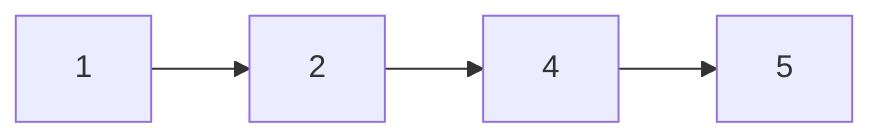
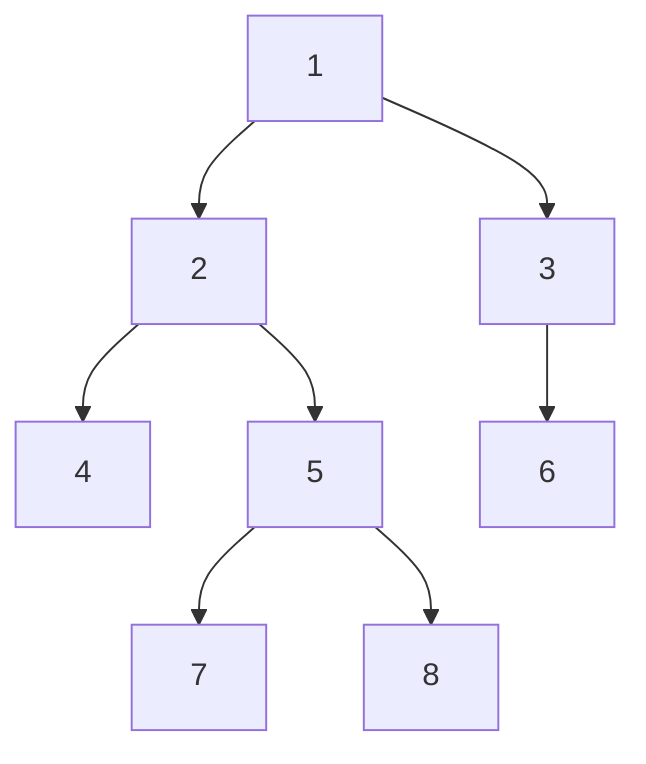
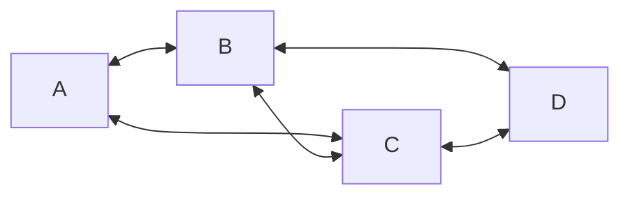

### 数据结构的三要素

#### 逻辑结构

1. `集合结构`
2. `线性结构`：一对一

e.g. 排行榜、排队取号

3. `树形结构`：一对多

e.g. 思维导图、文件夹存储

4. `图结构`：多对多

e.g. 道路、朋友关系

#### 数据结构的基本运算

e.g. 
- 查找第 `i` 个数据元素
- 在第 `i` 个位置插入新的数据元素
- 删除第 `i` 个位置
- ...

#### 数据的物理结构（存储结构）

- 顺序表
- 链式表
- 索引表
- 散列表（又称哈希表）

### 线性表

线性表一般包含以下功能：
- 初始化线性表
- 获取指定位置上的元素
- 获取元素的位置
- 插入元素
- 删除元素
- 获取长度

#### 顺序表

